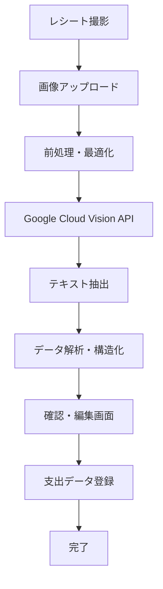

# レシートOCRシステム - 機能設計書

## 📋 概要

**機能名**: レシートOCRシステム  
**優先度**: 🟡 High  
**推定工数**: 3週間  
**実装予定**: Phase 2 (2025年8月13日〜)

### 目的
レシート撮影から自動でテキスト抽出し、支出データとして登録するシステムを構築。手動入力の手間を大幅に削減し、正確性を向上させる。

## 🎯 ユーザーストーリー

1. **忙しい会社員として**、レシート撮影だけで支出を記録したい
2. **家計管理する主婦として**、買い物後すぐに正確な支出を登録したい
3. **出張の多いビジネスマンとして**、経費精算用のレシートを効率的に処理したい
4. **お店での支払い時に**、その場で即座に記録を完了させたい

## 🚀 機能詳細

### 1. OCR処理フロー

#### 1.1 基本フロー


#### 1.2 処理ステップ詳細

**Step 1: 画像取得・前処理**
```typescript
interface ImageProcessing {
  // 画像の前処理
  enhanceImage: (imageBuffer: Buffer) => Promise<Buffer>
  cropReceipt: (image: Buffer) => Promise<Buffer>
  adjustContrast: (image: Buffer) => Promise<Buffer>
  removeNoise: (image: Buffer) => Promise<Buffer>
}

interface ReceiptImage {
  original: Buffer
  processed: Buffer
  metadata: {
    width: number
    height: number
    format: string
    quality: number
  }
}
```

**Step 2: OCR実行**
```typescript
interface OCRResult {
  fullText: string
  blocks: TextBlock[]
  confidence: number
  language: string
}

interface TextBlock {
  text: string
  boundingBox: {
    x: number
    y: number
    width: number
    height: number
  }
  confidence: number
}
```

**Step 3: データ抽出・構造化**
```typescript
interface ExtractedReceiptData {
  storeName?: string
  storeAddress?: string
  phoneNumber?: string
  date?: Date
  time?: Date
  totalAmount?: number
  taxAmount?: number
  items: ReceiptItem[]
  paymentMethod?: string
  confidence: {
    overall: number
    storeName: number
    date: number
    total: number
    items: number
  }
}

interface ReceiptItem {
  name: string
  quantity?: number
  unitPrice?: number
  totalPrice: number
  taxRate?: number
  confidence: number
}
```

### 2. 抽出ロジック

#### 2.1 店名抽出
```typescript
class StoreNameExtractor {
  // 既知店舗データベースとのマッチング
  private storeDatabase: Map<string, StoreInfo>
  
  extractStoreName(text: string): {
    name: string
    confidence: number
    knownStore: boolean
  } {
    // 1. レシート上部の大きなテキストを抽出
    // 2. 既知店舗データベースとの部分一致
    // 3. パターンマッチング（株式会社、有限会社等）
    // 4. 信頼度スコア算出
  }
}
```

#### 2.2 金額抽出
```typescript
class AmountExtractor {
  extractAmounts(text: string): {
    totalAmount: number
    subTotal?: number
    tax?: number
    items: Array<{
      name: string
      amount: number
      quantity?: number
    }>
  } {
    // 1. 「合計」「小計」「税込」等のキーワード検索
    // 2. 金額パターンの正規表現マッチング
    // 3. 商品名と金額のペア抽出
    // 4. 計算検証（小計+税=合計）
  }
  
  private readonly AMOUNT_PATTERNS = [
    /¥\s*(\d{1,3}(?:,\d{3})*)/g,
    /(\d{1,3}(?:,\d{3})*)\s*円/g,
    /(\d{1,3}(?:,\d{3})*)\s*-/g
  ]
  
  private readonly TOTAL_KEYWORDS = [
    '合計', '総計', '計', 'TOTAL', '税込', '小計'
  ]
}
```

#### 2.3 日付抽出
```typescript
class DateTimeExtractor {
  extractDateTime(text: string): {
    date: Date
    time?: Date
    confidence: number
  } {
    // 日付パターンの検出
    const datePatterns = [
      /(\d{4})[\/\-年](\d{1,2})[\/\-月](\d{1,2})[日]?/,
      /(\d{1,2})[\/\-](\d{1,2})[\/\-](\d{4})/,
      /令和(\d+)年(\d{1,2})月(\d{1,2})日/
    ]
    
    // 時刻パターンの検出
    const timePatterns = [
      /(\d{1,2}):(\d{2}):(\d{2})/,
      /(\d{1,2}):(\d{2})/
    ]
  }
}
```

### 3. UI/UX設計

#### 3.1 撮影画面
```
┌─────────────────────────────────────┐
│  📷 レシート撮影                     │
├─────────────────────────────────────┤
│                                     │
│    ┌─────────────────────────┐    │
│    │                         │    │
│    │     📄 レシートを       │    │
│    │     この枠内に収めて     │    │
│    │     撮影してください     │    │
│    │                         │    │
│    └─────────────────────────┘    │
│                                     │
│               [📷]                  │
│                                     │
│ [💡] ヒント：                      │
│ ・レシート全体が見えるように        │
│ ・影がかからないように              │
│ ・文字がぼやけないように            │
│                                     │
│ [📁 ギャラリーから選択]             │
└─────────────────────────────────────┘
```

#### 3.2 OCR処理中画面
```
┌─────────────────────────────────────┐
│  🔍 レシート解析中...               │
├─────────────────────────────────────┤
│                                     │
│           ⚡ 処理状況                │
│                                     │
│     ✅ 画像の最適化完了             │
│     🔄 文字認識実行中...           │
│     ⏳ データ抽出待機中             │
│     ⏳ 構造化処理待機中             │
│                                     │
│         [════════    ] 75%          │
│                                     │
│ 💡 高精度な認識のため、              │
│    数十秒お待ちください             │
│                                     │
│           [キャンセル]               │
└─────────────────────────────────────┘
```

#### 3.3 確認・編集画面
```
┌─────────────────────────────────────┐
│  ✏️ レシート内容確認                │
├─────────────────────────────────────┤
│ 📸 [撮影画像]     🏪 店舗情報       │
│ ┌─────────────┐ ┌───────────────┐ │
│ │     📄      │ │🏪 セブンイレブン│ │
│ │  [レシート]  │ │📍 渋谷店        │ │
│ │             │ │📅 2025/06/23   │ │
│ │             │ │🕒 14:32        │ │
│ └─────────────┘ └───────────────┘ │
│                                     │
│ 💰 合計金額                         │
│ ¥ [1,234] ← 自動入力 ✏️編集可能    │
│                                     │
│ 📝 購入商品                         │
│ ┌─────────────────────────────┐  │
│ │ペットボトル茶    ¥150    [❌]│  │
│ │おにぎり(鮭)     ¥120    [❌]│  │
│ │アイスコーヒー    ¥110    [❌]│  │
│ │チョコレート      ¥98     [❌]│  │
│ └─────────────────────────────┘  │
│ [+ 商品を追加]                      │
│                                     │
│ 🏷️ カテゴリ                        │
│ [食費 ▼] (自動判定)                │
│                                     │
│ 💳 支払方法                         │
│ [現金 ▼] (推定)                    │
│                                     │
│ 📝 メモ                             │
│ [セブンで昼食購入]                  │
│                                     │
│ [💾 保存] [🔄 再解析] [❌ キャンセル] │
└─────────────────────────────────────┘
```

### 4. 精度向上システム

#### 4.1 店舗データベース連携
```typescript
interface StoreDatabase {
  stores: Map<string, StoreInfo>
  
  // 店名の正規化・マッチング
  normalizeStoreName(rawName: string): string
  findBestMatch(extractedName: string): StoreInfo | null
  
  // 学習データの蓄積
  recordCorrection(extracted: string, corrected: string): void
}

interface StoreInfo {
  id: string
  name: string
  aliases: string[]         // 別名・略称
  category: string          // デフォルトカテゴリ
  paymentMethods: string[]  // 対応支払方法
  location?: {
    address: string
    coordinates: [number, number]
  }
}
```

#### 4.2 機械学習による改善
```typescript
interface MLOptimization {
  // ユーザー修正の学習
  learnFromCorrection(
    original: ExtractedReceiptData,
    corrected: ExtractedReceiptData
  ): void
  
  // 精度スコアの改善
  improveConfidenceScore(
    ocrResult: OCRResult,
    userFeedback: boolean
  ): void
  
  // パターン認識の強化
  strengthenPatterns(
    receiptType: string,
    successfulExtractions: ExtractedReceiptData[]
  ): void
}
```

### 5. エラーハンドリング

#### 5.1 認識失敗時の対応
```typescript
enum OCRErrorType {
  POOR_IMAGE_QUALITY = 'poor_image_quality',
  UNSUPPORTED_FORMAT = 'unsupported_format',
  NO_TEXT_FOUND = 'no_text_found',
  EXTRACTION_FAILED = 'extraction_failed',
  API_ERROR = 'api_error'
}

interface OCRErrorHandler {
  handleError(error: OCRErrorType, context: any): {
    message: string
    suggestions: string[]
    fallbackOptions: string[]
  }
}
```

#### 5.2 フォールバック機能
- **手動入力モード**: OCR失敗時の手動入力
- **写真再撮影**: 画質改善のための再撮影提案
- **部分認識**: 一部のみ認識成功時の補完機能

## 💾 データベース設計

### レシート画像テーブル
```sql
CREATE TABLE receipt_images (
  id UUID PRIMARY KEY DEFAULT uuid_generate_v4(),
  user_id UUID NOT NULL REFERENCES auth.users(id) ON DELETE CASCADE,
  image_url TEXT NOT NULL,
  image_hash VARCHAR(64) UNIQUE, -- 重複防止
  file_size INTEGER,
  mime_type VARCHAR(50),
  
  -- OCR結果
  ocr_text TEXT,
  ocr_confidence DECIMAL(5,4),
  extracted_data JSONB,
  
  -- 処理状況
  processing_status VARCHAR(20) DEFAULT 'pending',
  processed_at TIMESTAMP WITH TIME ZONE,
  error_message TEXT,
  
  -- 関連データ
  expense_group_id UUID REFERENCES expense_groups(id),
  store_id UUID REFERENCES stores(id),
  
  created_at TIMESTAMP WITH TIME ZONE DEFAULT NOW(),
  updated_at TIMESTAMP WITH TIME ZONE DEFAULT NOW()
);

CREATE INDEX idx_receipt_images_user_id ON receipt_images(user_id);
CREATE INDEX idx_receipt_images_status ON receipt_images(processing_status);
CREATE INDEX idx_receipt_images_processed_at ON receipt_images(processed_at);
```

### OCR学習データテーブル
```sql
CREATE TABLE ocr_learning_data (
  id UUID PRIMARY KEY DEFAULT uuid_generate_v4(),
  receipt_image_id UUID REFERENCES receipt_images(id) ON DELETE CASCADE,
  
  -- 抽出結果
  extracted_store_name TEXT,
  extracted_amount DECIMAL(10,2),
  extracted_date DATE,
  extracted_items JSONB,
  
  -- ユーザー修正結果
  corrected_store_name TEXT,
  corrected_amount DECIMAL(10,2),
  corrected_date DATE,
  corrected_items JSONB,
  
  -- 学習用メタデータ
  correction_type VARCHAR(50),
  confidence_improvement DECIMAL(5,4),
  
  created_at TIMESTAMP WITH TIME ZONE DEFAULT NOW()
);
```

## 🔧 実装計画

### Week 1: 基盤実装
- [ ] Google Cloud Vision API統合
- [ ] 画像アップロード・前処理機能
- [ ] 基本OCR実行機能
- [ ] データベース設計・実装

### Week 2: データ抽出・UI実装
- [ ] 店名・金額・日付抽出ロジック
- [ ] 撮影UI実装
- [ ] 処理状況表示機能
- [ ] 確認・編集画面実装

### Week 3: 精度向上・統合
- [ ] 店舗データベース連携
- [ ] エラーハンドリング
- [ ] 学習機能実装
- [ ] 支出データとの統合

## 📊 成功指標

### 定量的指標
- **OCR精度**: 店名85%、金額90%、日付95%以上
- **処理時間**: 平均10秒以内
- **ユーザー満足度**: 4.2/5以上
- **利用率**: 全支出登録の40%以上がOCR経由

### 定性的指標
- 「入力が圧倒的に楽になった」
- 「精度が期待以上に高い」
- 「時短効果を実感できる」

## 🔒 セキュリティ・プライバシー

### データ保護
- レシート画像の暗号化保存
- 個人情報の自動マスキング
- 画像の自動削除オプション
- GDPR対応の削除機能

### API セキュリティ
- Google Cloud Vision APIキーの安全な管理
- レート制限対応
- エラーログの適切な管理

---
最終更新: 2025-06-23  
ステータス: 📋 Planning